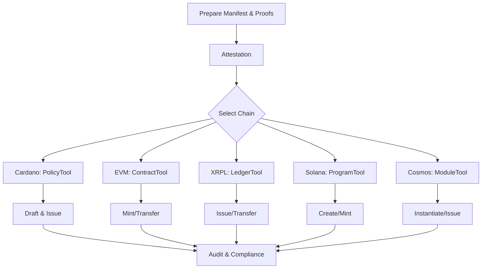

# RWA-Mines: Multi-Chain Real World Asset Suite

---

<p align="center">
	
</p>

---

## <span style="color:#0078D4">Table of Contents</span>

- [Overview](#overview)
- [Features](#features)
- [Architecture](#architecture)
- [Operator Workflow](#operator-workflow)
- [Security](#security)
- [Quick Start](#quick-start)
- [Flow Chart](#flow-chart)
- [Directory Structure](#directory-structure)
- [Contributing](#contributing)
- [License](#license)

---

## <span style="color:#43A047">Overview</span>

**RWA-Mines** is a production-ready, multi-chain platform for deploying and managing Real World Assets (RWAs) across Cardano, EVM, XRPL, Solana, and Cosmos. It provides secure, auditable, and compliant workflows for asset issuance, attestation, and operator automation.

---

## <span style="color:#F9A825">Features</span>

- **Multi-Chain Support:** Cardano, EVM, XRPL, Solana, Cosmos
- **Operator Automation:** One-click VS Code tasks for all flows
- **Security:** AES-256-GCM encrypted seeds, hash-based attestations
- **Compliance:** Built-in compliance and proof generation
- **CI/CD:** Automated GitHub Actions for all chains
- **Extensible:** Modular design for new chains and features

---

## <span style="color:#1976D2">Architecture</span>

| Chain    | Tools (C#/.NET)         | Key Operations                |
|----------|------------------------|-------------------------------|
| Cardano  | PolicyTool, HashAttest | Policy, Attestation, Drafting |
| EVM      | ContractTool, TokenTool| Deploy, Verify, Mint, Transfer|
| XRPL     | LedgerTool, TokenTool  | Submit, Status, Issue, Transfer|
| Solana   | ProgramTool, TokenTool | Deploy, Verify, Mint, Create  |
| Cosmos   | ModuleTool, TokenTool  | Store, Instantiate, Issue, Transfer|

---

## <span style="color:#8E24AA">Operator Workflow</span>

1. **Prepare**: Generate manifests and compliance proofs
2. **Attest**: Create cryptographic attestations for assets
3. **Deploy**: Deploy contracts/programs/modules on target chain
4. **Issue**: Mint or issue tokens to recipients
5. **Transfer**: Move tokens as required

All steps are automated via VS Code tasks and produce JSON artifacts for auditability.

---

## <span style="color:#D84315">Security</span>

- All seeds encrypted with AES-256-GCM
- Hash-only attestations (no sensitive data)
- Deterministic, auditable operations
- SSH-based GitHub access (SHA256:BDiD2HGxpXl3eipFms/nM+QXQWh9oIkIyFofdnxJ/OM)

---

## <span style="color:#0288D1">Quick Start</span>

```bash
# Clone the repo
git clone git@github.com:Trustiva7777/RWA-Mines.git
cd RWA-Mines

# Install dependencies
pnpm bootstrap

# Build all .NET tools
dotnet build rwa-suite/chains/*/tools/*/*.csproj

# Use VS Code tasks for operator flows
```

---

## <span style="color:#43A047">Flow Chart</span>



---

## <span style="color:#6D4C41">Directory Structure</span>

```text
rwa-suite/
 chains/
 cardano/
 evm/
 xrpl/
 solana/
 cosmos/
 docs/
 .vscode/
 .github/
 ...
```

---

## <span style="color:#1565C0">Contributing</span>

Pull requests are welcome! Please see [CONTRIBUTING.md](CONTRIBUTING.md) for guidelines.

---

## <span style="color:#263238">License</span>

MIT License © 2025 Trustiva7777
